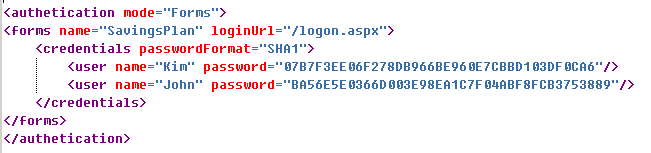
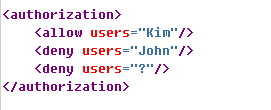
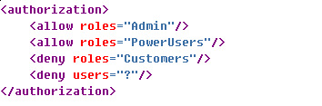
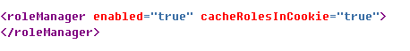

# How to use a membership system in ASP.NET.

ASP.NET includes several features that make it easy to control access to your web site.
For example, we can use ASP.NET authentication to identify a user with a user name and password.
It can store these credentials, along with other information about that user in a database. 
You can config ASP.NET authentication and authorization by using the Web.config file for the website.
You can use the ASP.NET login controls to build login pages for user authentication and authorization by 
using the Web.config file for the Web site.

You can use the ASP.NET login controls to build login pages for user authentication and authorization.
The <b>Membership</b> class provides methods for validating users' credentials and managing users' settings.
You can use the Roles class to group users, depending on their role in the application, and assign access to parts of the 
system on that basis.

<h2>Authentication for Web Applications</h2>

<strong>Authentication</strong> is the process by which users prove their identity. This usually involves users entering a username and password, or credentials, onto a login page. ASP .NET 2.0 provides the following authentication mechanisms:

<ol>
<li>Windows authentication</li>
<li>Forms authentication</li>
</ol>

<strong>1. Windows Authentication</strong>
If you configure your application to use Windows Authentication, IIS identifies the user by comparing the credentials entered by the user against the user's Windows account. Windows authentication provides three possible login methods:

 
<ul>
<li><strong>Basic authentication:</strong> In this method the credentials are passed across the network in plain text.</li>
<li><strong>Digest authentication:</strong> In this method the password is irreversibly hashed before it is transmitted.</li>
<li><strong>Windows Integrated authentication:</strong> In this method, the user is authenticated in the same way as when logging on to a Active Directory service domain.</li>
</ul>

The method IIS chooses for a particular user will depend on the browser being used and the configuration of IIS. For example, only IE supports the Windows Integrated method; other browser will use Basic authetication.

<strong>2. Forms Authentication</strong>

Windows authentication is useful only if all users have Windows accounts. if you are building an Internet application, using Windows authentication will not be feasible or desirable.
Consequently, you might prefer to store user accounts somewhere other than the Windows security system. For example, you can elect to store user credentials in a database hosted on a computer, and include other properties not present in a Windows account. The Forms authentication mode makes it easy for you to create such a customized security regime and to do so securely. 

When you configure Forms authentication, you can specify a login page. When users request any page in your application, if they are not authenticated, they are redirected to the login page where they can enter their credentials. You must write code to check these credentials. After they have been authenticated, user are redirected to the page they originally requested.

If you have a small number of users, you can store credentials in the Web.config file. However, a more scalable storage location, such as a database, is recommended for most situations.

By default, Forms authentication creates a cookie when the user has logged on, and it stores the cookie on the user's computer. This cookie is submitted with each request. However, Forms authentication can also be configured to use the query string for browsers that have had cookie support disabled.

You can configure Forms authentication by using the Web.config file. The following example specifies that users should be directed to a logon page called logon.aspx, and it has the details of two users. The password has been irreversibly hashed:

<h2>Authorization for Web Applications</h2>

After a user has been authenticated and has gained access to your Web site, the application must determine the pages and resources that the user has access to. This process is known as authorization.

<strong>File Authorization</strong>

Windows provides its own authorization mechanism. You can set permissions on any file or folder stored on a disk formatted with the NTFS file system. These permissions are stored in the access control list (ACL), which is stored with the file. The ASP.NET File authorization module enables you to use these permissions to control access to resources, pages, and folders in your Web application. You must use it in conjunction with Windows authentication.

To use File authorization, configure your application to use Windows authentication, and then assign permission to the files and folders in your Web site.

<strong>URL Authorization</strong>

You can use the URL authorization module to control access to each virtual directory within your Web site hierarchy. You can use URL authorization with any of the authentication modules.

To establish permissions for a particular directory, create a Web config file within that directory.
Add to the file an <em>authorization</em> section that contains <em>allow</em> and <em>deny</em> tags for each user or role. There are two special values that you can also use as wildcard identities:

<ol>
<li>* This wildcard entry applies to everyone who visits the directory.</li>
<li>? This entry applies to anonymous users.</li>
</ol>

In the following example, Kim is permitted to access the current directory, but John and anonymous users are denied access:

<strong>Site Membership systems using the Membership Class</strong>

Many websites implement a membership system. ASP.NET 2.0 includes a set of classes that enable you to build such a system, using a database or other location for storing member details.

<strong>The Components of a Typical Membership System</strong>

To manage user accounts on your Web site, you must do more than authenticate and authorize users. The following features are typically required:

<ul>
<li>User account creation and deletion. New users to your Web site will need to add a new account for themselves and be able to modify their personal data. You might also want to remove unused accounts.</li>
<li>User account storage, you can store user accounts in any alternative data store.</li>
<li>Authentication. If you are using Forms authentication mode, you can use ASP.NET login controls to create a login page with little or no custom code.</li>
<li>Password management. You should provide a means of creating and resetting passwords, setting password expiration, and recovering or resetting lost passwords.</li>
</ul>

The ASP.NET Membership system includes classes to help you implement all these features. You can use these classes to create a versatile membership system by using a very small amount of code. ASP.NET Membership can be used on its own or in conjunction with Forms authentication and ASP.NET Roles.

<strong>The Membership Class</strong>

You can use the <strong>Membership</strong> class to configure a membership system. The Membership class provides a method for creating, deleting, and updating user accounts, authenticating users, and managing passwords. 

<strong>Login Controls</strong>

The ASP.NET login controls are a set of Web server controls that provide the common user interface elements of a membership system. The following controls are available in the Login section of the VS Toolbox. 

<ul>
<li><strong>CreateUserWizard:</strong> This control collects information from the user and creates </li>
<li><strong>Login:</strong> This control consists of user name and password text boxes and a check box that users can use to indicate that they would like to be remembered the next time they visit. User credentials are authenticated by the membership system.</li>
<li><strong>LoginStatus:</strong> This control displays either a Login link or a logout link, depending on whether the user is currently logged in.</li>
<li><strong>LoginView:</strong> Use this control to display different information to logged-in users and anonymous users. For example, you might want to display links to enhanced content for members, but not for anonymous users.</li>
<li><strong>PasswordRecovery:</strong> This control enables users to recover a forgotten password if they can answer a security question. If the password is stored with reversible encryption, it is sent to the user via e-mail; otherwise, a new password is issued.</li>
<li><strong>ChangePassword:</strong> This control enables the user to change his or her password.</li>
</ul>
<strong>Web Site Security Administration using the Roles Class.</strong>

You can use roles to reduce the administrative overhead of managing permissions for large numbers of users. You can group users into roles and assign permissions to each role. All users belonging to a role automatically gain the permissions associated with that role when they log in. For example, you could have roles for Administrators, Moderators, Power Users, and so on. If you had to assign permission to every single user individually, it would take a long time and require very long <em>authorization</em> tags in the Web.config files. By grouping users into roles, you can assign permissions once for many users; the system becomes far more manageable.

<strong>Roles and Authorization</strong>

If you are using URL authorization mode, you configure access to a directory by using the Web.config file in each directory. You can add roles to the <em>authorization</em> section. The following example shows how to grant access to members of the Admin and PowerUsers roles but deny access to members of the Customers role and anonymous users:

<strong>Role Management Configuration</strong>

You must configure role management in the Web.config file in the root folder of the Web
application. The following example shows how to enable role management and specifies that a cookie will be downloaded to the client to store role membership details:

<strong>Creating and Populating Roles</strong>

However, you can also create and populate roles programmatically by using the Roles class. The following example creates a roles called Subscribers and adds two users to it:

<pre>
[C#]
Roles.CreateRole("Subscribers");
Roles.AddUsersToRole("Anatoly Sabantsev","Subscribers");
Roles.AddUsersToRole("Bobby Moore","Subscribers");
</pre>
<strong>Checking Role Membership</strong>

You can use the User object to check whether the current user is a member  of a particular role. The code in the following example hides the btnDownloadFile button if the  user is not a member of the Subscriber role:
<pre>
if(!User.IsInRole("Subscribers"))
	btnDownloadFile.Visible = false;
</pre>

